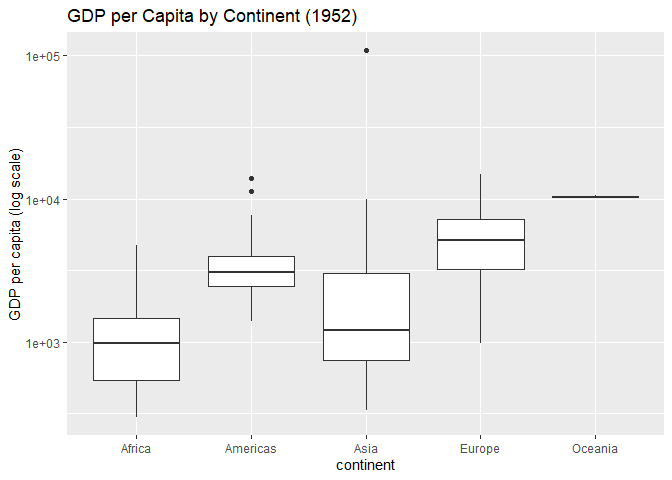
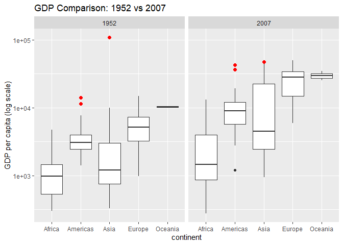
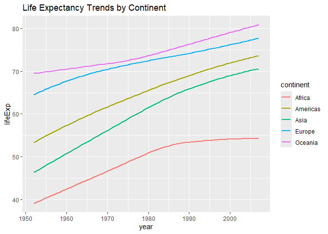

Gapminder
================
Elisa Camacho
2020-

- [Grading Rubric](#grading-rubric)
  - [Individual](#individual)
  - [Submission](#submission)
- [Guided EDA](#guided-eda)
  - [**q0** Perform your “first checks” on the dataset. What variables
    are in
    this](#q0-perform-your-first-checks-on-the-dataset-what-variables-are-in-this)
  - [**q1** Determine the most and least recent years in the `gapminder`
    dataset.](#q1-determine-the-most-and-least-recent-years-in-the-gapminder-dataset)
  - [**q2** Filter on years matching `year_min`, and make a plot of the
    GDP per capita against continent. Choose an appropriate `geom_` to
    visualize the data. What observations can you
    make?](#q2-filter-on-years-matching-year_min-and-make-a-plot-of-the-gdp-per-capita-against-continent-choose-an-appropriate-geom_-to-visualize-the-data-what-observations-can-you-make)
  - [**q3** You should have found *at least* three outliers in q2 (but
    possibly many more!). Identify those outliers (figure out which
    countries they
    are).](#q3-you-should-have-found-at-least-three-outliers-in-q2-but-possibly-many-more-identify-those-outliers-figure-out-which-countries-they-are)
  - [**q4** Create a plot similar to yours from q2 studying both
    `year_min` and `year_max`. Find a way to highlight the outliers from
    q3 on your plot *in a way that lets you identify which country is
    which*. Compare the patterns between `year_min` and
    `year_max`.](#q4-create-a-plot-similar-to-yours-from-q2-studying-both-year_min-and-year_max-find-a-way-to-highlight-the-outliers-from-q3-on-your-plot-in-a-way-that-lets-you-identify-which-country-is-which-compare-the-patterns-between-year_min-and-year_max)
- [Your Own EDA](#your-own-eda)
  - [**q5** Create *at least* three new figures below. With each figure,
    try to pose new questions about the
    data.](#q5-create-at-least-three-new-figures-below-with-each-figure-try-to-pose-new-questions-about-the-data)

*Purpose*: Learning to do EDA well takes practice! In this challenge
you’ll further practice EDA by first completing a guided exploration,
then by conducting your own investigation. This challenge will also give
you a chance to use the wide variety of visual tools we’ve been
learning.

<!-- include-rubric -->

# Grading Rubric

<!-- -------------------------------------------------- -->

Unlike exercises, **challenges will be graded**. The following rubrics
define how you will be graded, both on an individual and team basis.

## Individual

<!-- ------------------------- -->

| Category | Needs Improvement | Satisfactory |
|----|----|----|
| Effort | Some task **q**’s left unattempted | All task **q**’s attempted |
| Observed | Did not document observations, or observations incorrect | Documented correct observations based on analysis |
| Supported | Some observations not clearly supported by analysis | All observations clearly supported by analysis (table, graph, etc.) |
| Assessed | Observations include claims not supported by the data, or reflect a level of certainty not warranted by the data | Observations are appropriately qualified by the quality & relevance of the data and (in)conclusiveness of the support |
| Specified | Uses the phrase “more data are necessary” without clarification | Any statement that “more data are necessary” specifies which *specific* data are needed to answer what *specific* question |
| Code Styled | Violations of the [style guide](https://style.tidyverse.org/) hinder readability | Code sufficiently close to the [style guide](https://style.tidyverse.org/) |

## Submission

<!-- ------------------------- -->

Make sure to commit both the challenge report (`report.md` file) and
supporting files (`report_files/` folder) when you are done! Then submit
a link to Canvas. **Your Challenge submission is not complete without
all files uploaded to GitHub.**

``` r
library(tidyverse)
```

    ## ── Attaching core tidyverse packages ──────────────────────── tidyverse 2.0.0 ──
    ## ✔ dplyr     1.1.4     ✔ readr     2.1.5
    ## ✔ forcats   1.0.0     ✔ stringr   1.5.1
    ## ✔ ggplot2   3.5.1     ✔ tibble    3.2.1
    ## ✔ lubridate 1.9.4     ✔ tidyr     1.3.1
    ## ✔ purrr     1.0.2     
    ## ── Conflicts ────────────────────────────────────────── tidyverse_conflicts() ──
    ## ✖ dplyr::filter() masks stats::filter()
    ## ✖ dplyr::lag()    masks stats::lag()
    ## ℹ Use the conflicted package (<http://conflicted.r-lib.org/>) to force all conflicts to become errors

``` r
library(gapminder)
```

*Background*: [Gapminder](https://www.gapminder.org/about-gapminder/) is
an independent organization that seeks to educate people about the state
of the world. They seek to counteract the worldview constructed by a
hype-driven media cycle, and promote a “fact-based worldview” by
focusing on data. The dataset we’ll study in this challenge is from
Gapminder.

# Guided EDA

<!-- -------------------------------------------------- -->

First, we’ll go through a round of *guided EDA*. Try to pay attention to
the high-level process we’re going through—after this guided round
you’ll be responsible for doing another cycle of EDA on your own!

### **q0** Perform your “first checks” on the dataset. What variables are in this

dataset?

``` r
## TASK: Do your "first checks" here!
glimpse(gapminder)
```

    ## Rows: 1,704
    ## Columns: 6
    ## $ country   <fct> "Afghanistan", "Afghanistan", "Afghanistan", "Afghanistan", …
    ## $ continent <fct> Asia, Asia, Asia, Asia, Asia, Asia, Asia, Asia, Asia, Asia, …
    ## $ year      <int> 1952, 1957, 1962, 1967, 1972, 1977, 1982, 1987, 1992, 1997, …
    ## $ lifeExp   <dbl> 28.801, 30.332, 31.997, 34.020, 36.088, 38.438, 39.854, 40.8…
    ## $ pop       <int> 8425333, 9240934, 10267083, 11537966, 13079460, 14880372, 12…
    ## $ gdpPercap <dbl> 779.4453, 820.8530, 853.1007, 836.1971, 739.9811, 786.1134, …

**Observations**:

- Write all variable names here

### **q1** Determine the most and least recent years in the `gapminder` dataset.

*Hint*: Use the `pull()` function to get a vector out of a tibble.
(Rather than the `$` notation of base R.)

``` r
## TASK: Find the largest and smallest values of `year` in `gapminder`
#year_max <- NA_real_
#year_min <- NA_real_
# Find the most recent and least recent years
year_max <- gapminder %>% pull(year)  %>% max()

year_min <- gapminder %>% pull(year)  %>% min()


# results
year_max
```

    ## [1] 2007

``` r
year_min
```

    ## [1] 1952

Use the following test to check your work.

``` r
## NOTE: No need to change this
assertthat::assert_that(year_max %% 7 == 5)
```

    ## [1] TRUE

``` r
assertthat::assert_that(year_max %% 3 == 0)
```

    ## [1] TRUE

``` r
assertthat::assert_that(year_min %% 7 == 6)
```

    ## [1] TRUE

``` r
assertthat::assert_that(year_min %% 3 == 2)
```

    ## [1] TRUE

``` r
if (is_tibble(year_max)) {
  print("year_max is a tibble; try using `pull()` to get a vector")
  assertthat::assert_that(False)
}

print("Nice!")
```

    ## [1] "Nice!"

### **q2** Filter on years matching `year_min`, and make a plot of the GDP per capita against continent. Choose an appropriate `geom_` to visualize the data. What observations can you make?

You may encounter difficulties in visualizing these data; if so document
your challenges and attempt to produce the most informative visual you
can.

``` r
## TASK: Create a visual of gdpPercap vs continent
gapminder_1952 <- gapminder %>% filter(year == year_min)

# Create a boxplot of gdpPercap vs continent for 1952
gapminder_1952 %>%
  ggplot(aes(x = continent, y = gdpPercap)) +
  geom_boxplot() +
  labs(
    title = "GDP per Capita by Continent (1952)",
    x = "Continent",
    y = "GDP per Capita (USD)"
  ) +
  theme_minimal()
```

<!-- -->

**Observations**: There are a few outliers in Asia and Europe, where
some countries have significantly higher GDP per capita than the rest.
Oceania and Europe have higher median GDP per capita compared to other
continents. Africa has the lowest median GDP per capita. The spread of
GDP per capita is widest in Asia, indicating significant economic
diversity. Europe has a relatively narrow spread, suggesting more
economic homogeneity. **Difficulties & Approaches**: Some countries have
extremely high GDP per capita, which can skew the plot.

### **q3** You should have found *at least* three outliers in q2 (but possibly many more!). Identify those outliers (figure out which countries they are).

``` r
## TASK: Identify the outliers from q2
gapminder_1952 <- gapminder %>% filter(year == year_min)

# Calculate the IQR and upper whisker for each continent
outliers_1952 <- gapminder_1952 %>%
  group_by(continent) %>%
  mutate(
    Q1 = quantile(gdpPercap, 0.25),  # First quartile (25th percentile)
    Q3 = quantile(gdpPercap, 0.75),  # Third quartile (75th percentile)
    IQR = Q3 - Q1,                   # Interquartile range
    Upper_Whisker = Q3 + 1.5 * IQR   # Upper whisker
  ) %>%
  filter(gdpPercap > Upper_Whisker)  # Filter for outliers

# Display the outliers
outliers_1952
```

    ## # A tibble: 9 × 10
    ## # Groups:   continent [4]
    ##   country       continent  year lifeExp       pop gdpPercap    Q1    Q3   IQR
    ##   <fct>         <fct>     <int>   <dbl>     <int>     <dbl> <dbl> <dbl> <dbl>
    ## 1 Angola        Africa     1952    30.0   4232095     3521.  535. 1455.  920.
    ## 2 Bahrain       Asia       1952    50.9    120447     9867.  750. 3035. 2286.
    ## 3 Canada        Americas   1952    68.8  14785584    11367. 2428. 3940. 1512.
    ## 4 Gabon         Africa     1952    37.0    420702     4293.  535. 1455.  920.
    ## 5 Kuwait        Asia       1952    55.6    160000   108382.  750. 3035. 2286.
    ## 6 South Africa  Africa     1952    45.0  14264935     4725.  535. 1455.  920.
    ## 7 Switzerland   Europe     1952    69.6   4815000    14734. 3241. 7237. 3996.
    ## 8 United States Americas   1952    68.4 157553000    13990. 2428. 3940. 1512.
    ## 9 Venezuela     Americas   1952    55.1   5439568     7690. 2428. 3940. 1512.
    ## # ℹ 1 more variable: Upper_Whisker <dbl>

``` r
# Create a boxplot with outliers highlighted
gapminder_1952 %>%
  ggplot(aes(x = continent, y = gdpPercap)) +
  geom_boxplot() +
  geom_point(
    data = outliers_1952,  # Highlight outliers
    aes(color = country),
    size = 3
  ) +
  labs(
    title = "GDP per Capita by Continent (1952) with Outliers Highlighted",
    x = "Continent",
    y = "GDP per Capita (USD)"
  ) +
  theme_minimal()
```

<!-- -->

**Observations**:

- Identify the outlier countries from q2
  - (Your response here)

*Hint*: For the next task, it’s helpful to know a ggplot trick we’ll
learn in an upcoming exercise: You can use the `data` argument inside
any `geom_*` to modify the data that will be plotted *by that geom
only*. For instance, you can use this trick to filter a set of points to
label:

``` r
## NOTE: No need to edit, use ideas from this in q4 below
gapminder %>%
  filter(year == max(year)) %>%

  ggplot(aes(continent, lifeExp)) +
  geom_boxplot() +
  geom_point(
    data = . %>% filter(country %in% c("United Kingdom", "Japan", "Zambia")),
    mapping = aes(color = country),
    size = 2
  )
```

<!-- -->

### **q4** Create a plot similar to yours from q2 studying both `year_min` and `year_max`. Find a way to highlight the outliers from q3 on your plot *in a way that lets you identify which country is which*. Compare the patterns between `year_min` and `year_max`.

*Hint*: We’ve learned a lot of different ways to show multiple
variables; think about using different aesthetics or facets.

``` r
## TASK: Create a visual of gdpPercap vs continent\
gapminder_years <- gapminder %>% filter(year %in% c(year_min, year_max))

# Identify outliers from q3
outliers_1952 <- gapminder %>%
  filter(year == year_min) %>%
  group_by(continent) %>%
  mutate(
    Q1 = quantile(gdpPercap, 0.25),  # First quartile (25th percentile)
    Q3 = quantile(gdpPercap, 0.75),  # Third quartile (75th percentile)
    IQR = Q3 - Q1,                   # Interquartile range
    Upper_Whisker = Q3 + 1.5 * IQR   # Upper whisker
  ) %>%
  filter(gdpPercap > Upper_Whisker)  # Filter for outliers

# Create a plot comparing gdpPercap vs continent for both years
gapminder_years %>%
  ggplot(aes(x = continent, y = gdpPercap)) +
  geom_boxplot() +
  geom_point(
    data = outliers_1952,  # Highlight outliers from 1952
    aes(color = country),
    size = 3
  ) +
  facet_wrap(~year, ncol = 1) +  # Facet by year
  labs(
    title = "GDP per Capita by Continent (1952 vs 2007)",
    subtitle = "Outliers from 1952 highlighted",
    x = "Continent",
    y = "GDP per Capita (USD)"
  ) +
  theme_minimal()
```

<!-- -->

**Observations**: The comparison between 1952 and 2007 shows significant
economic growth across all continents.

The outliers in 1952 (e.g., Kuwait) highlight countries that were
already economically advanced at the time.

The rise of new outliers in 2007 reflects the emergence of new economic
powerhouses.

# Your Own EDA

<!-- -------------------------------------------------- -->

Now it’s your turn! We just went through guided EDA considering the GDP
per capita at two time points. You can continue looking at outliers,
consider different years, repeat the exercise with `lifeExp`, consider
the relationship between variables, or something else entirely.

### **q5** Create *at least* three new figures below. With each figure, try to pose new questions about the data.

``` r
## TASK: Your first graph
# Plot life expectancy over time by continent
gapminder %>%
  ggplot(aes(x = year, y = lifeExp, color = continent)) +
  geom_smooth(se = FALSE) +  # Add smoothed trend lines
  labs(
    title = "Life Expectancy Over Time by Continent",
    x = "Year",
    y = "Life Expectancy (years)",
    color = "Continent"
  ) +
  theme_minimal()
```

    ## `geom_smooth()` using method = 'loess' and formula = 'y ~ x'

<!-- -->

- (Your notes and observations here) Trends:

Life expectancy has increased steadily across all continents from 1952
to 2007.

Europe and Oceania have the highest life expectancy, while Africa has
the lowest.

Questions:

Why does Africa have a significantly lower life expectancy compared to
other continents?

What factors contributed to the rapid increase in life expectancy in
Asia after the 1960s?

``` r
## TASK: Your second graph
# Plot GDP per capita vs life expectancy
gapminder %>%
  ggplot(aes(x = gdpPercap, y = lifeExp, color = continent)) +
  geom_point(alpha = 0.6) +  # Add points with transparency
  scale_x_log10() +  # Use log scale for GDP per capita
  labs(
    title = "GDP per Capita vs Life Expectancy",
    x = "GDP per Capita (USD, log scale)",
    y = "Life Expectancy (years)",
    color = "Continent"
  ) +
  theme_minimal()
```

<!-- -->

- (Your notes and observations here) Relationship:

There is a positive correlation between GDP per capita and life
expectancy.

Countries with higher GDP per capita tend to have higher life
expectancy.

Outliers:

Some countries (e.g., in Africa) have low GDP per capita but relatively
high life expectancy.

Some countries (e.g., in Asia) have high GDP per capita but
lower-than-expected life expectancy.

Questions:

What explains the outliers with low GDP per capita but high life
expectancy?

Are there diminishing returns to life expectancy as GDP per capita
increases?

``` r
## TASK: Your third graph
# Plot population growth by continent over time
gapminder %>%
  group_by(continent, year) %>%
  summarise(total_pop = sum(pop)) %>%  # Calculate total population per continent
  ggplot(aes(x = year, y = total_pop, color = continent)) +
  geom_line() +  # Add line plot
  labs(
    title = "Population Growth by Continent Over Time",
    x = "Year",
    y = "Total Population",
    color = "Continent"
  ) +
  theme_minimal()
```

    ## `summarise()` has grouped output by 'continent'. You can override using the
    ## `.groups` argument.

<!-- -->

- (Your notes and observations here) Trends:

Asia has the highest population and the fastest growth rate.

Africa shows rapid population growth starting in the 1980s.

Europe has relatively stable population growth.

Questions:

Why does Africa show a sudden increase in population growth after the
1980s?

What factors contribute to the slower population growth in Europe
compared to other continents?
